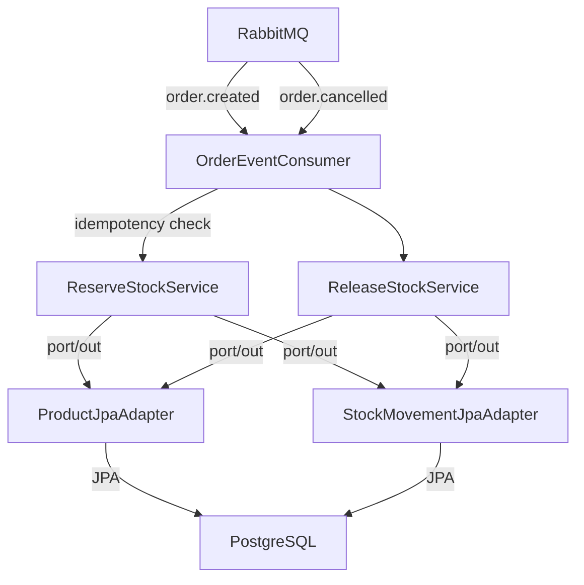

# inventory-service

<p align="center">
  
  
  
  
  
  
</p>

Stock management service of the [Order Processing System](https://github.com/mh001-code) — a microservices portfolio project demonstrating event-driven architecture, idempotency, and clean hexagonal design.

---

## Table of Contents

- [About](#about)
- [Architecture](#architecture)
- [Tech Stack](#tech-stack)
- [Business Rules](#business-rules)
- [Running Locally](#running-locally)
- [Endpoints](#endpoints)
- [Technical Decisions](#technical-decisions)

---

## About

The `inventory-service` reacts to order events published by `order-service` and manages product stock accordingly. It never communicates directly with other services — all integration happens through RabbitMQ. Idempotency guarantees that a redelivered event never causes a double deduction.

```
order-service → order.created   → RabbitMQ → inventory-service (reserve stock)
             → order.cancelled  →           → inventory-service (release stock)
```

---

## Architecture

The project follows **Hexagonal Architecture (Ports & Adapters)**, keeping the domain isolated from infrastructure concerns.

```
┌─────────────────────────────────────────────────────┐
│                     API Layer                        │
│           Controllers · DTOs · ExceptionHandler      │
└──────────────────────┬──────────────────────────────┘
                       │
┌──────────────────────▼──────────────────────────────┐
│                 Application Layer                    │
│            Use Cases · Port Interfaces               │
└──────────────────────┬──────────────────────────────┘
                       │
┌──────────────────────▼──────────────────────────────┐
│                  Domain Layer                        │
│     Product · StockMovement · StockMovementType      │
└─────────────────────────────────────────────────────┘
                       │
┌──────────────────────▼──────────────────────────────┐
│              Infrastructure Layer                    │
│     JPA Adapters · RabbitMQ Consumer · Config        │
└─────────────────────────────────────────────────────┘
```



**Base package:** `com.orderprocessing.inventory.service`

```
com.orderprocessing.inventory.service
├── domain
│   ├── model          # Product, StockMovement, StockMovementType
│   └── exception      # ProductNotFoundException, InsufficientStockException, ProductAlreadyExistsException
├── application
│   ├── usecase        # ReserveStockService, ReleaseStockService, CreateProductService, ...
│   └── port
│       ├── in         # ReserveStockUseCase, ReleaseStockUseCase, CreateProductUseCase, ...
│       └── out        # ProductRepositoryPort, StockMovementRepositoryPort
├── infrastructure
│   ├── persistence    # JPA repositories + adapters
│   ├── messaging      # OrderEventConsumer, event records
│   └── config         # RabbitMQConfig
└── api
    ├── controller     # ProductController, HealthController
    ├── dto            # Request/Response records
    └── handler        # GlobalExceptionHandler
```

---

## Tech Stack

| Technology | Version | Role |
|---|---|---|
| [Java](https://openjdk.org/) | 17 | Primary language |
| [Spring Boot](https://spring.io/projects/spring-boot) | 3.5 | Web framework + DI |
| [Spring AMQP](https://spring.io/projects/spring-amqp) | — | RabbitMQ consumer |
| [Spring Data JPA](https://spring.io/projects/spring-data-jpa) | — | ORM persistence |
| [PostgreSQL](https://www.postgresql.org/) | 16 | Relational database |
| [Flyway](https://flywaydb.org/) | — | Database migrations |
| [Lombok](https://projectlombok.org/) | — | Boilerplate reduction |
| [JUnit 5 + Mockito](https://junit.org/junit5/) | — | Unit testing |
| [Testcontainers](https://testcontainers.com/) | — | Integration tests with real PostgreSQL + RabbitMQ |
| [Docker](https://www.docker.com/) | — | Containerization (multi-stage build) |
| [GitHub Actions](https://github.com/features/actions) | — | CI/CD pipeline |

---

## Business Rules

- Products have a unique **SKU** — duplicates return `409 Conflict`
- `stockQuantity` can never go negative — `InsufficientStockException` is thrown before any deduction
- When `order.created` is received: stock is decremented for each item (**RESERVE**)
- When `order.cancelled` is received: stock is incremented back for each item (**RELEASE**)
- Both operations are **`@Transactional`** — all items in an order succeed or none do
- Every event is processed **idempotently**: if the same `order.created` arrives twice, stock is only decremented once
- Failed messages (product not found, insufficient stock) are routed to Dead Letter Queues and the consumer moves on

---

## Running Locally

### Prerequisites

- Java 17+
- Docker and Docker Compose
- Maven (or use the included `./mvnw` wrapper)

### 1. Clone the repository

```bash
git clone https://github.com/mh001-code/inventory-service.git
cd inventory-service
```

### 2. Start PostgreSQL and RabbitMQ

```bash
docker-compose up -d
```

PostgreSQL on port `5436` · RabbitMQ on port `5672` · Management UI on `15672`

### 3. Run the application

```bash
./mvnw spring-boot:run
```

The API will be available at `http://localhost:8081`.
RabbitMQ Management UI: http://localhost:15672 (guest / guest)

### 4. Run the tests

```bash
# All tests including integration (Docker required for Testcontainers)
./mvnw test
```

---

## Endpoints

| Method | Route | Description | Status |
|---|---|---|---|
| `GET` | `/products` | List all products | 200 |
| `GET` | `/products/{id}` | Get product and current stock | 200 / 404 |
| `POST` | `/products` | Register a new product with initial stock | 201 / 409 |
| `PUT` | `/products/{id}/stock` | Manually adjust stock (replenishment) | 200 / 404 |
| `GET` | `/health` | Health check | 200 |

### Create Product — Example

```json
POST /products
{
  "name": "Notebook",
  "sku": "NTB-001",
  "description": "15-inch laptop",
  "unitPrice": 3500.00,
  "initialStock": 50
}
```

### HTTP Status Codes

| Status | Situation |
|---|---|
| `201 Created` | Product successfully registered |
| `200 OK` | Query or stock update successful |
| `404 Not Found` | Product not found |
| `409 Conflict` | SKU already registered |

---

## Technical Decisions

**Idempotency via `stock_movements` table**
Before reserving stock, the service checks whether a `StockMovement` record with `(orderId, RESERVE)` already exists. If it does, the event is acknowledged and skipped — stock is only decremented once regardless of how many times the same event arrives. This handles RabbitMQ redelivery scenarios without side effects.

**`@Transactional` on reserve and release**
An order can contain multiple items. The entire reserve operation runs in a single transaction — either all items are decremented or none are. This prevents partial stock updates that would leave the system in an inconsistent state.

**Dead Letter Queues instead of requeue**
`default-requeue-rejected: false` ensures that a message causing an unrecoverable error (e.g. product not found) goes directly to the DLQ instead of looping indefinitely. This keeps the consumer healthy and gives operators a clear audit trail.

**Hexagonal Architecture**
`ReserveStockService` depends on `ProductRepositoryPort` and `StockMovementRepositoryPort` — pure interfaces. Unit tests inject mocks; integration tests inject real JPA adapters. The domain logic is never polluted by Spring or JPA annotations.

**Testcontainers for integration tests**
A singleton container pattern is used — PostgreSQL and RabbitMQ containers start once for the entire test suite and are shared across all test classes, keeping the suite fast while testing real behavior.

---

<p align="center">
  Built by <a href="mailto:marcioincode@gmail.com">Márcio Henrique</a>
</p>
